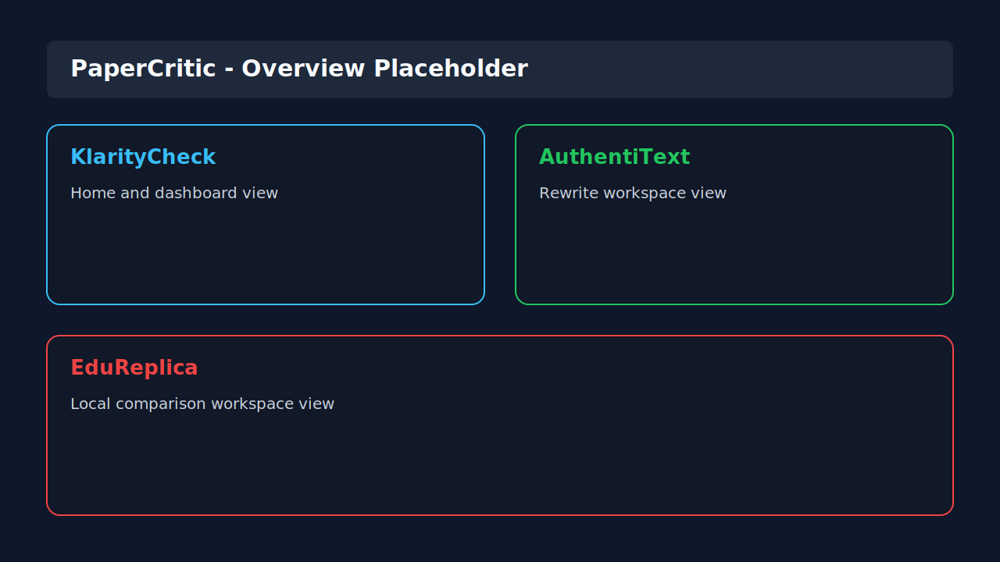
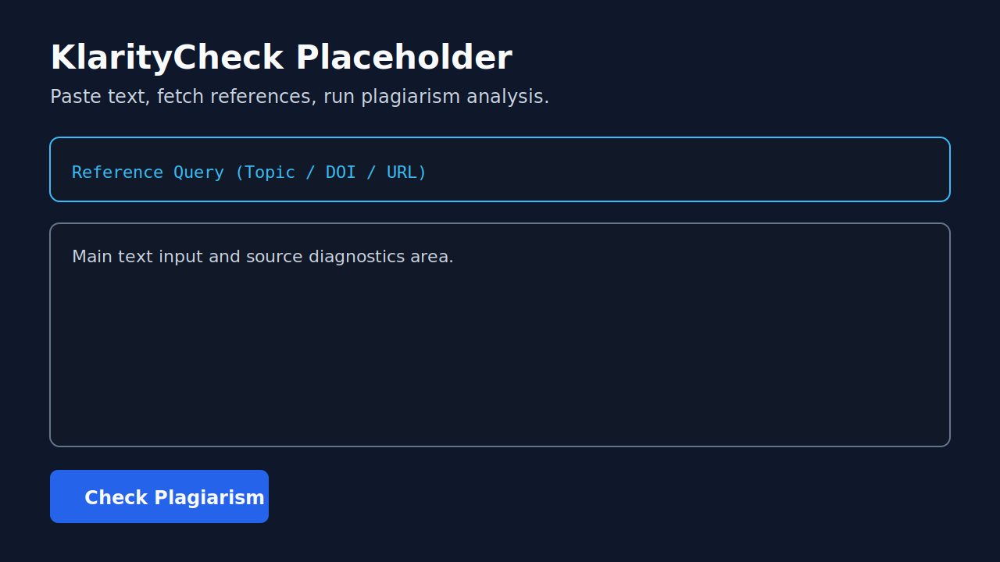
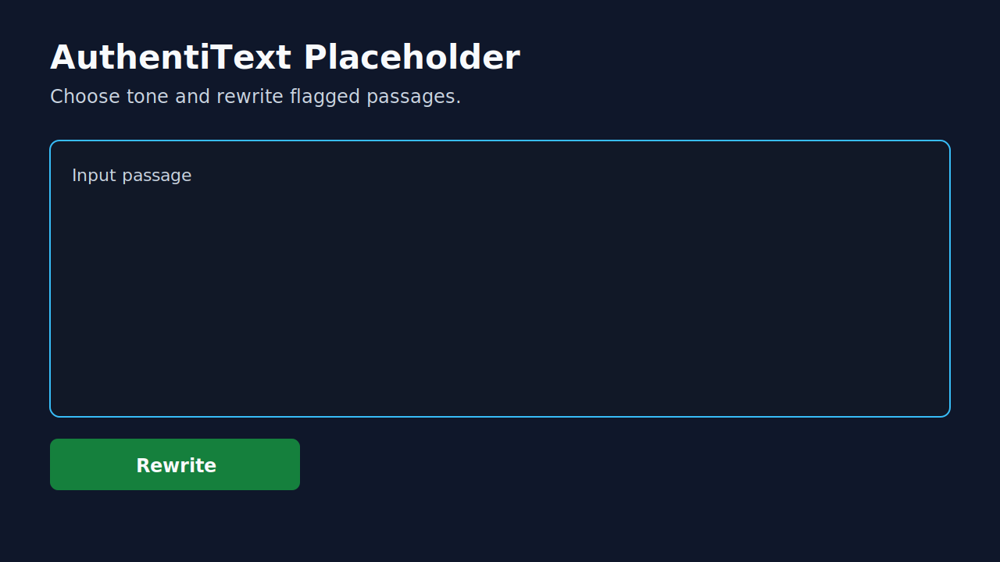
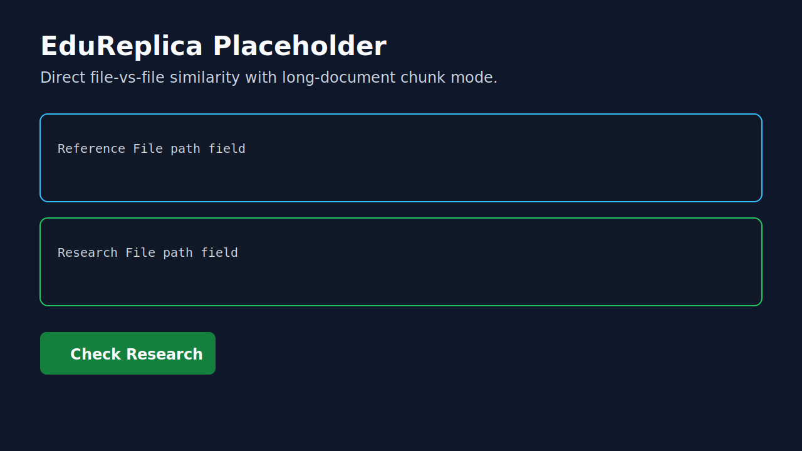
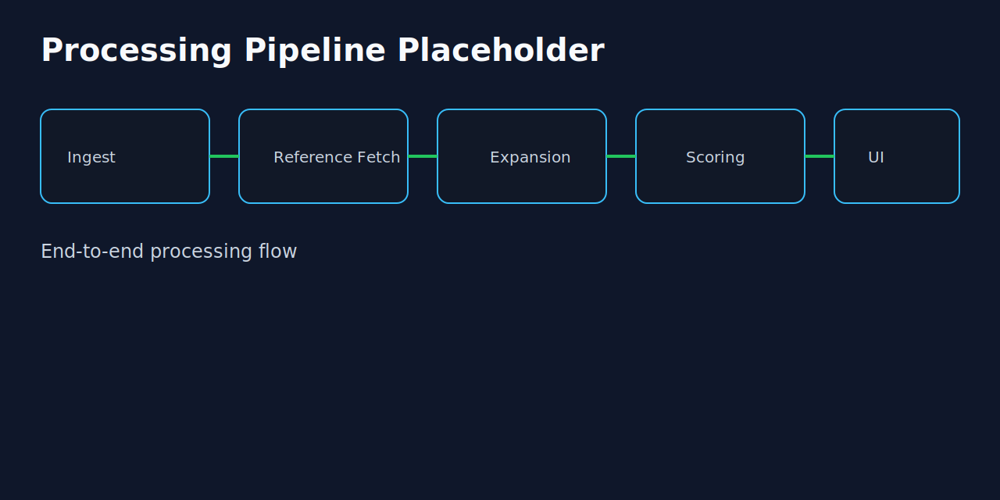
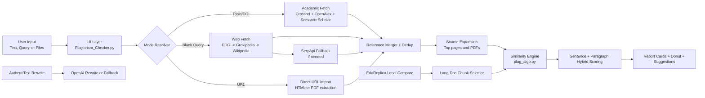

# PaperCritic

PaperCritic is a desktop plagiarism analysis workspace built with Tkinter.
It combines three tools in one app:

- `KlarityCheck` for reference-aware plagiarism checks against web and academic sources.
- `AuthentiText` for tone-based rewriting of flagged passages.
- `EduReplica` for local file-vs-file similarity checks.

## Navigation

- [Part I: The Application](#part-i-the-application)
- [Part II: Setup](#part-ii-setup)
- [Architecture Design](#architecture-design)
- [Development Notes](#development-notes)



---

## Part I: The Application

### 1) Product Map

#### Home
The home screen is a launch pad. It routes the user to each working area without mixing workflows.

#### KlarityCheck
`KlarityCheck` is the source-aware checker. It accepts pasted text or uploaded files (`.txt`, `.docx`, `.pdf`) and compares against fetched references.



#### AuthentiText
`AuthentiText` rewrites text in a selected tone (`Professional`, `Creative`, `Formal`, `Casual`).
If `OPENAI_API_KEY` is present, it uses OpenAI. If not, it falls back to clear local messaging.



#### EduReplica
`EduReplica` compares two local files directly (reference file vs research file).
It now includes a long-document optimization mode for faster checks on large files.



---

### 2) How KlarityCheck Works

#### Input and Mode Resolution
KlarityCheck resolves behavior from the optional query field:

- `Topic/DOI` query: fetches academic references plus web references.
- `URL` query: fetches and compares against that URL only.
- Blank query with source text present: runs paragraph-based web search.

#### Reference Fetch Pipeline
Web provider sequence is ordered and explicit:

1. DuckDuckGo Lite
2. Grokipedia
3. Wikipedia
4. SerpApi fallback (when `SERPAPI_API_KEY` is set)

If a provider returns low-overlap references, the pipeline continues to the next provider before committing results.

#### Source Expansion
For top web references, the app expands beyond snippets:

- Fetches readable full-page content.
- Detects PDF sources (`.pdf` URL path or `application/pdf` content type).
- Extracts PDF text with `PyPDF2` for deeper comparison.
- Merges snippet + expanded content to preserve direct search-hit language.

Only up to 3 deduplicated web references are retained in the final blend to keep quality high and noise low.

#### Scoring Engine (Hybrid Similarity)
The engine in `plag_algo.py` blends lexical and contextual signals:

- Token cosine similarity
- Character n-gram cosine similarity
- Sequence similarity
- Concept overlap
- Angle-based similarity transform

Then it combines sentence-level and paragraph-level alignment for each candidate match.

Classification labels:

- `Exact Match` for highest-confidence overlap
- `Near Match`
- `Paraphrased Overlap`

UI output includes:

- Overall plagiarism vs originality percentages
- Top match cards with source links and confidence
- Suggestions for reducing plagiarism risk

#### Long-Document Strategy in KlarityCheck
For very long text input, KlarityCheck builds an analysis payload from distributed regions (beginning, middle, end) instead of naively processing only the first section. This improves topic coverage and response speed.

---

### 3) How EduReplica Works

EduReplica performs direct local-text comparison using the same similarity core, but without web fetching.

#### Standard Mode
For normal-sized files, it compares extracted full text from both files.

#### Long-Document Mode
When either file is large, EduReplica switches to chunk mode:

- Splits each file into overlapping word chunks.
- Builds token-overlap candidates between research chunks and reference chunks.
- Selects the most promising chunk pairs plus anchor chunks (start/middle/end regions).
- Compares reduced texts for faster, still-relevant similarity estimates.

The result panel reports chunk usage so users know when optimized mode was used.

---

### 4) File and Module Layout

| File | Responsibility |
| --- | --- |
| `Plagiarism_Checker.py` | Tkinter UI, page routing, loading states, user actions, reporting |
| `plag_algo.py` | File extraction, reference retrieval, web expansion, similarity scoring |
| `.env.example` | Environment variable template |
| `requirements.txt` | Python dependencies |
| `docs/images/` | Replaceable documentation image placeholders |

---

### 5) Runtime Behavior Notes

- Loading indicators are page-scoped and anchored near action buttons across all tools.
- Missing API keys do not crash the app.
- Without `OPENAI_API_KEY`, rewrite actions provide fallback guidance.
- Without `SERPAPI_API_KEY`, SerpApi fallback is skipped.
- PDF extraction quality depends on whether PDFs contain selectable text. Image-only scans may require OCR preprocessing outside this app.



---

## Part II: Setup

### 1) Prerequisites

- Python 3.10+ (3.11+ recommended)
- Internet access for web and academic reference retrieval
- Optional API keys for advanced features

### 2) Install

Open a terminal in the project root and run:

```powershell
python -m venv .venv
.\.venv\Scripts\Activate.ps1
pip install -r requirements.txt
```

If PowerShell blocks script execution, run this once in an elevated shell:

```powershell
Set-ExecutionPolicy -ExecutionPolicy RemoteSigned -Scope CurrentUser
```

### 3) Environment Configuration

Copy `.env.example` to `.env` and fill values as needed.

```env
OPENAI_API_KEY=your_openai_api_key_here
SERPAPI_API_KEY=your_serpapi_api_key_here
SERPAPI_ENGINE=google
SERPAPI_HL=en
SERPAPI_GL=us
```

What each key does:

- `OPENAI_API_KEY`: Enables AI rewrite/suggestion features in AuthentiText and top-card suggestions.
- `SERPAPI_API_KEY`: Enables SerpApi fallback when first-hand web providers are weak or unavailable.
- `SERPAPI_ENGINE`, `SERPAPI_HL`, `SERPAPI_GL`: Optional regional/language tuning for SerpApi.

### 4) Run the App

```powershell
python Plagiarism_Checker.py
```

### 5) Basic Usage Checklist

1. Open `KlarityCheck`.
2. Paste text or upload a file.
3. Optionally enter topic/DOI/URL query.
4. Click `Fetch References` or go straight to `Check Plagiarism` (auto-fetch enabled).
5. Review overlap cards and source links.
6. Move flagged content to `AuthentiText` when you want a rewrite.

### 6) Troubleshooting

- `No references found`: verify internet connection and query specificity.
- `SerpApi fallback is disabled`: add `SERPAPI_API_KEY` to `.env`.
- `Rewrite assistant is unavailable`: install `openai` and provide `OPENAI_API_KEY`.
- Very low overlap on scanned PDFs: ensure the PDF has selectable text or run OCR before import.

---

## Architecture Design

### Mermaid View



### Text View

1. UI receives text, optional query, and/or uploaded files.
2. Mode resolution decides whether the run is topic-based, URL-only, or blank-query web search.
3. Reference pipeline fetches candidate sources, then deduplicates and expands top pages/PDFs.
4. Similarity engine computes hybrid overlap using sentence and paragraph context.
5. UI presents percentages, match cards, source links, and rewrite paths.
6. EduReplica can bypass web fetch and use local text with chunk optimization for long documents.

---

## Development Notes

- Main UI constants and long-doc thresholds live near the top of `Plagiarism_Checker.py`.
- Retrieval and scoring logic live in `plag_algo.py`.
- Keep placeholder images in `docs/images/` until final screenshots are available.
